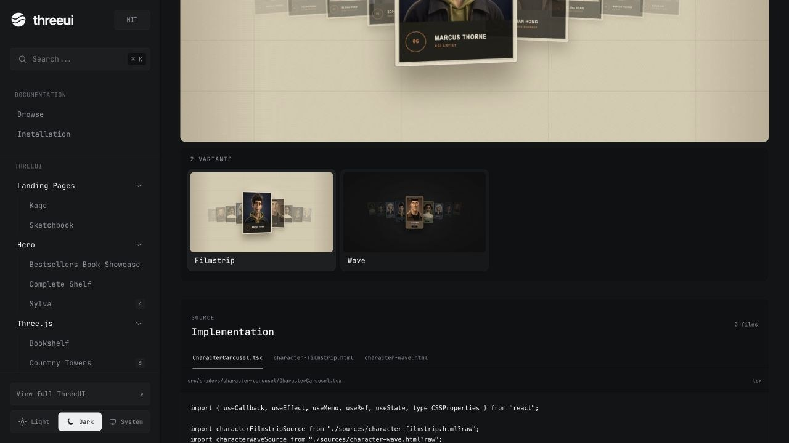

Thư viện 3D UI mã nguồn mở cực đẹp 🎉 cho website với hơn 150+ hiệu ứng, chỉ một câu prompt AI với thư viện này bạn sẽ có ngay hiệu ứng bắt mắt khác biệt

Nếu bạn muốn tạo những website có hero 3D, shader, animation và hiệu ứng WebGL nhưng không muốn bắt đầu mọi thứ từ con số 0, ThreeUI của Meng To là một dự án rất đáng chú ý.

ThreeUI Community là phiên bản mã nguồn mở, không cần đăng nhập, cung cấp các component Three js có thể xem trực tiếp, tùy chỉnh và lấy source để đưa vào dự án. 

Có gì nổi bật?

* 50+ component 3D Community, với tổng cộng 164 kết quả/variant để khám phá.
* Live preview, variant picker, controls, themes và responsive layout.
* Các hiệu ứng Three js, Shader, WebGL được thiết kế sẵn theo hướng production-ready.
* Có thể lấy source code và chỉnh sửa trực tiếp bằng React.
* Hỗ trợ component package qua npm: @designcodeio/threeui.
* Có thể import từng component riêng để giảm kích thước dependency.
* Phù hợp để xây dựng landing page, portfolio, SaaS, product page và website AI có giao diện 3D ấn tượng. 

Đặc biệt hợp với AI Coding

Điểm mình thích ở ThreeUI là cách dự án kết hợp component 3D + source code + variant.

Thay vì nói với AI:

“Hãy tạo cho tôi một hiệu ứng 3D đẹp.”

Bạn có thể đưa một component ThreeUI cho Claude Code, Codex hoặc Cursor, sau đó yêu cầu:

“Giữ nguyên cấu trúc 3D này, đổi màu, lighting, animation và nội dung theo thương hiệu của tôi.”

Đây là hướng rất phù hợp với xu thế AI-generated UI: bắt đầu từ một thiết kế có sẵn chất lượng cao rồi để agent tiếp tục customize.

ThreeUI cho thấy tương lai của web design có thể không còn là “AI viết CSS từ đầu”, mà là AI lấy những visual component chất lượng cao rồi tự biến đổi chúng thành giao diện hoàn chỉnh.


# ThreeUI Community

The open-source, login-free edition of ThreeUI. It uses the same application shell, layout, navigation, browse grid, search, themes, responsive behavior, component pages, live renderers, controls, variant picker, and source tabs as the main project.

The catalog is the only product-level difference: Pro and Beta components are removed. Every Community component keeps all of its free variants and controls.

[Browse ThreeUI](https://threeui.com) · [View the source on GitHub](https://github.com/MengTo/threeui)



## Included

- 50 Community parent components
- 111 Community routes
- 141 free variant records, plus 23 singleton components (164 browse results)
- Complete Community implementation source and required assets
- No authentication, account state, checkout runtime, Pro implementation, or Beta implementation
- `Get Pro` links to `https://threeui.com/pricing`

## Run locally

```bash
npm install
npm run dev
```

Run the complete publication boundary, type, and production-build checks:

```bash
npm run build
```

## Install the React package

Install the public Community component library from npm:

```bash
npm install @designcodeio/threeui
```

Import a component and the shared styles:

```tsx
import { AtTheHorizon } from "@designcodeio/threeui";
import "@designcodeio/threeui/style.css";

export function Hero() {
  return <AtTheHorizon />;
}
```

For the smallest development import graph, use a component subpath:

```tsx
import { AtTheHorizon } from "@designcodeio/threeui/components/AtTheHorizon";
```

Components that render full HTML documents expect their runtime files at the same root-relative URLs used by the ThreeUI preview. Copy the needed files from `node_modules/@designcodeio/threeui/lib-dist/assets/` into your app's public directory, or override the component's `sourceUrl` or `assetBaseUrl` prop where available.

## Pro source access

Pro implementation source is deliberately not published to npm. Active ThreeUI Pro members authenticate through the browser and download an entitled source bundle with the public CLI:

```bash
npx @designcodeio/threeui-cli add cross-beam
```

The CLI uses OAuth with PKCE, stores its refreshable session with owner-only permissions, checks the account entitlement on every server request, and refuses to overwrite changed project files unless `--force` is supplied. Run `npx @designcodeio/threeui-cli --help` for login, logout, destination, and development endpoint options.

## Synchronization

The checked-in repository runs independently. Maintainers can refresh its Community subset from a separately held main-project snapshot:

```bash
npm run sync:community -- /path/to/main-threeui
```

The sync fails closed, filters Pro and Beta before generating the public import graph, preserves all free metadata and options, removes restricted font assets, and writes:

- `public/community-sync-report.json` — counts plus per-component variant/control parity
- `public/source-code.json` — Community source bundles used by the Code tab
- `src/data/shaders.tsx` — Community-only catalog and renderer imports

The private ThreeUI repository runs this synchronization after every successful push to `main`. A no-op sync exits without a release. Changes update the `automation/community-sync` branch and open one reviewed pull request here. New public components, variants, or controls infer a minor release; removals infer a major release; compatible source changes infer a patch release. Merging a versioned sync pull request publishes the new package through npm trusted publishing with provenance.

The public workflow also runs a clean build, boundary audit, package creation, and anonymous installation smoke test before release. The Pro installer is versioned and published separately; changes to Pro component content do not require a CLI release.

## License

Application code, Community component code, and ThreeUI-authored Community imagery are MIT licensed. Bundled open fonts remain under the SIL Open Font License 1.1, and bundled Three.js runtime files remain MIT licensed. Remote catalog thumbnails and previews loaded from `https://threeui.com` are not redistributed by this repository. See `ASSET-LICENSES.md`, `FONT-LICENSES.md`, and `THIRD_PARTY_NOTICES.md`.
